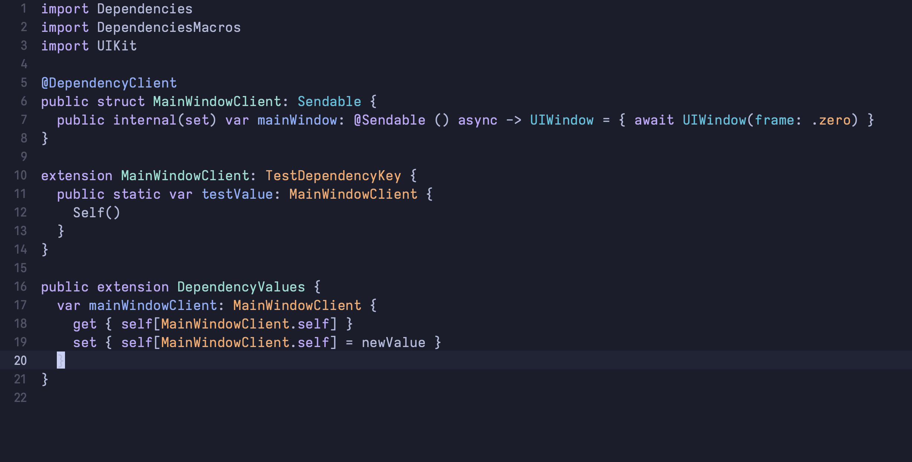
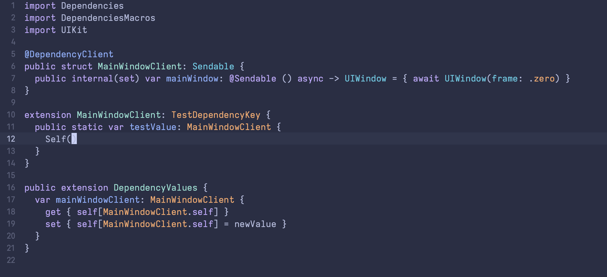
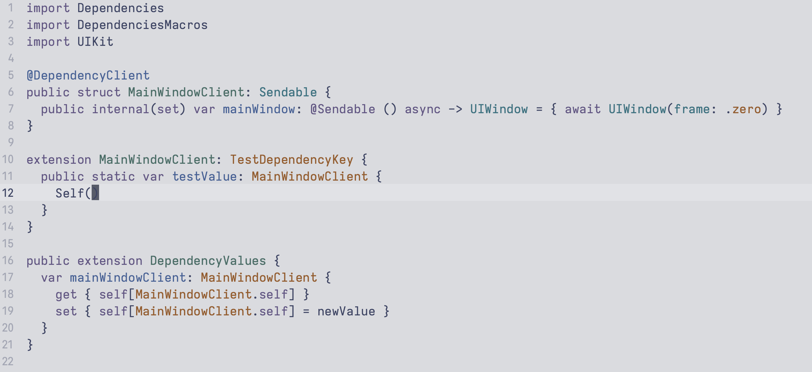

# Tokyo Night Theme for Xcode

Beautiful and sleek Tokyo Night theme for Xcode, inspired by the Tokyo Night color palette.
The Tokyo Night theme is designed to provide a comfortable and eye-friendly coding environment. It features a dark background with vibrant colors, making it easy to distinguish different elements in your code.

## Screenshots

Here are some screenshots of the Tokyo Night theme in action:

Tokyo Night


Tokyo Night Storm


Tokyio Night Light


## Features

- Beautiful dark theme inspired by Tokyo Night colors.
- Supports multiple color variations:
  - Tokyo Night
  - Tokyo Night Storm
  - Tokyo Night Light
- Easy installation script to set up the theme in Xcode.
- Includes support for the Iosevka Fixed font.

## Installation

Without any prerequisites and swift script running, you can just download this repo select all themes and just move it in 

```sh
~/Library/Developer/Xcode/UserData/FontAndColorThemes
```
Restart Xcode and you can rock.

### Prerequisites for installing with Script

Before installing the theme, ensure you have the following:

- Xcode installed on your macOS.
- Swift installed (should be included with Xcode).

### Steps

1. **Clone the Repository:**

   ```sh
   git clone https://github.com/tornikegomareli/TokyoNight-XcodeTheme.git
   cd TokyoNight-XcodeTheme
   ```

2. **Run the Installation Script:**

   Execute the Swift installation script to install the necessary fonts and copy the theme files to the appropriate directory.

   ```sh
   swift run
   ```

   The script will:
   - Check if Homebrew is installed and install it if necessary.
   - Check if the Iosevka Fixed font is installed and install it if necessary.
   - Copy the Tokyo Night theme files to the Xcode themes directory.

## Configuration

After installation, you can configure the theme in Xcode:

1. Open Xcode.
2. Go to `Preferences` -> `Fonts & Colors`.
3. Select the Tokyo Night theme of your choice (Tokyo Night, Tokyo Night Storm, or Tokyo Night Light).
